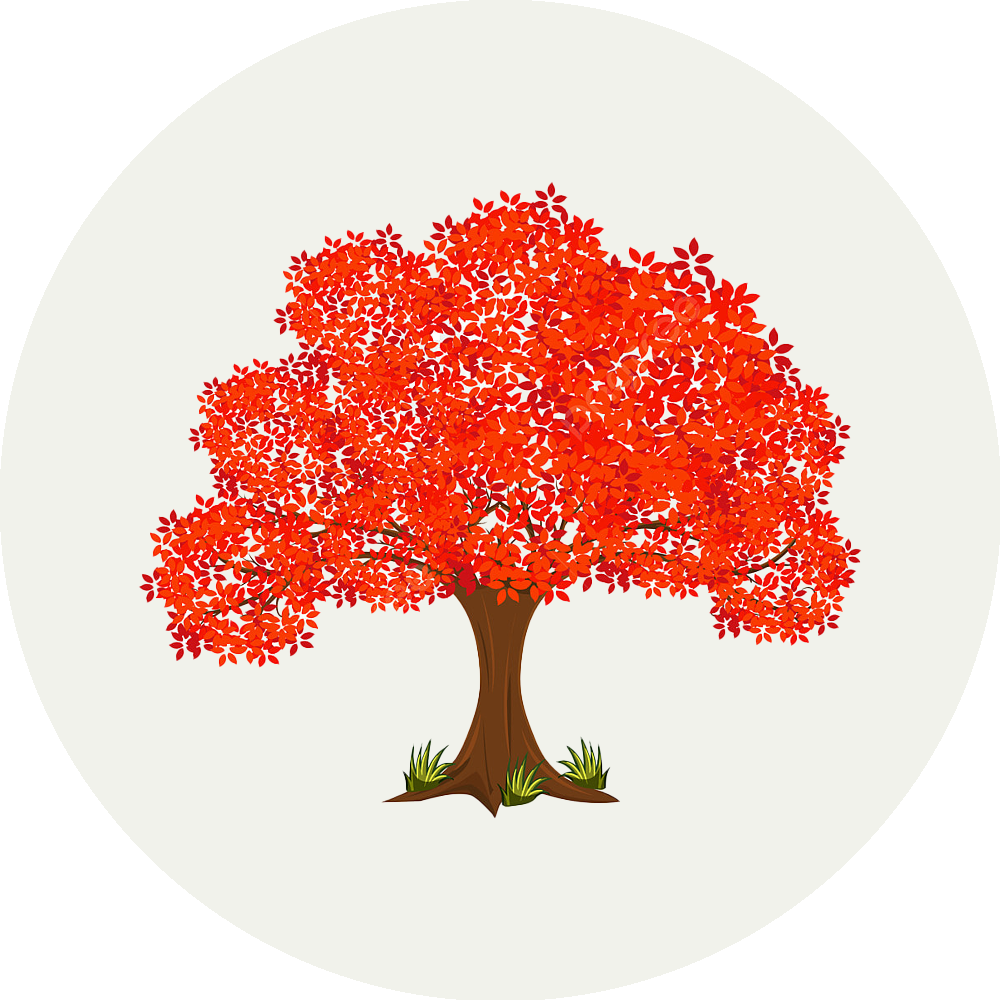

<!-- Improved compatibility of back to top link: See: https://github.com/othneildrew/Best-README-Template/pull/73 -->

<a name="readme-top"></a>

<!--
*** Thanks for checking out the Best-README-Template. If you have a suggestion
*** that would make this better, please fork the repo and create a pull request
*** or simply open an issue with the tag "enhancement".
*** Don't forget to give the project a star!
*** Thanks again! Now go create something AMAZING! :D
-->

<!-- PROJECT SHIELDS -->
<!--
*** I'm using markdown "reference style" links for readability.
*** Reference links are enclosed in brackets [ ] instead of parentheses ( ).
*** See the bottom of this document for the declaration of the reference variables
*** for contributors-url, forks-url, etc. This is an optional, concise syntax you may use.
*** https://www.markdownguide.org/basic-syntax/#reference-style-links
-->

<!-- [![Contributors][contributors-shield]][contributors-url]
[![Forks][forks-shield]][forks-url]
[![Stargazers][stars-shield]][stars-url]
[![Issues][issues-shield]][issues-url]
[![MIT License][license-shield]][license-url]
[![LinkedIn][linkedin-shield]][linkedin-url] -->

<!-- PROJECT LOGO -->
<br />
<div align="center">
  <a href="https://github.com/educational-technology-collective/srs-chrome-extension">
    
    <br />
  </a>

<h3 align="center">Ambient Learning Agent</h3>

  <p align="center">
    Your personal learning companion.
    <br />
    <!-- <a href="https://github.com/github_username/repo_name"><strong>Explore the docs »</strong></a>
    <br />
    <br />
    <a href="https://github.com/github_username/repo_name">View Demo</a>
    · -->
    <a href="https://github.com/educational-technology-collective/srs-chrome-extension/issues">Report Bug</a>
    ·
    <a href="https://github.com/educational-technology-collective/srs-chrome-extension/issues">Request Feature</a>
  </p>
</div>

<!-- TABLE OF CONTENTS -->
<details>
  <summary>Table of Contents</summary>
  <ol>
    <li>
      <a href="#about-the-project">About The Project</a>
      <ul>
        <li><a href="#built-with">Built With</a></li>
      </ul>
    </li>
    <li>
      <a href="#getting-started">Getting Started</a>
      <ul>
        <!-- <li><a href="#prerequisites">Prerequisites</a></li> -->
        <li><a href="#installation">Installation</a></li>
      </ul>
    </li>
    <li><a href="#usage">Usage</a></li>
    <li><a href="#roadmap">Roadmap</a></li>
    <li><a href="#contributing">Contributing</a></li>
    <li><a href="#license">License</a></li>
    <li><a href="#contact">Contact</a></li>
    <li><a href="#acknowledgments">Acknowledgments</a></li>
  </ol>
</details>

<!-- ABOUT THE PROJECT -->

## About The Project

<!-- [![Product Name Screen Shot][product-screenshot]](https://example.com) -->

<!-- Here's a blank template to get started: To avoid retyping too much info. Do a search and replace with your text editor for the following: `github_username`, `repo_name`, `twitter_handle`, `linkedin_username`, `email_client`, `email`, `project_title`, `project_description` -->

Unlock your full learning potential! Ambient Learning Agent uses automated detection technology to identify your most opportune moments for learning. Seamlessly integrated into your daily routine, it delivers personalized flashcards to the Ambient Learning mobile app that align perfectly with your current studies. Say goodbye to missed learning opportunities and hello to effortless knowledge retention. Start your journey towards effortless and effective learning today!

<p align="right">(<a href="#readme-top">back to top</a>)</p>

### Built With

<!-- - [![Next][Next.js]][Next-url]
- [![React][React.js]][React-url]
- [![Vue][Vue.js]][Vue-url]
- [![Angular][Angular.io]][Angular-url]
- [![Svelte][Svelte.dev]][Svelte-url]
- [![Laravel][Laravel.com]][Laravel-url]
- [![Bootstrap][Bootstrap.com]][Bootstrap-url]
- [![JQuery][JQuery.com]][JQuery-url] -->

![TypeScript]
![React]
![Vite]

<p align="right">(<a href="#readme-top">back to top</a>)</p>

<!-- GETTING STARTED -->

## Getting Started

To get a local copy up and running follow these simple example steps.

<!-- ### Prerequisites

This is an example of how to list things you need to use the software and how to install them.

- npm
  ```sh
  npm install npm@latest -g
  ``` -->

### Installing the Chrome Extension

Closed-alpha test users would've received the distribution as a `.crx` file.

1. Unzip the `.crx` file using utilities such as 7zip.
2. Go to the extensions page. Type `chrome://extensions` in the Chrome address bar and hit enter.
3. Click on the developer mode toggle on the top right of the page.
4. Click on the `Load unpacked` button on the top left of the page.
5. Select the unzipped folder when prompted.
6. Congratulations! You have the extension installed. Click on the puzzle piece icon on the toolbar. You should see the Ambient Learning Agent extension inside. Click on the pin icon on the right to pin it to the toolbar.
7. Now go to the Coursera SIADS 505 page [here](https://www.coursera.org/learn/siads505/home/week/1).
8. Click on the Ambient Learning Agent icon on the toolbar. A popup with a login page will show. Log into your `umich.edu` Google account and start watching lectures.

### Installation

1. Clone the repo.
   ```sh
   git clone https://github.com/educational-technology-collective/srs-chrome-extension.git
   ```
2. `cd` into the project directory and install NPM packages
   ```sh
   cd srs-chrome-extension
   npm install
   ```
3. Build the project
   ```sh
   npm run build
   ```
4. Go to the extensions page. Type `chrome://extensions` in the Chrome address bar and hit enter.
5. Click on the developer mode toggle on the top right of the page.
6. Click on the `Load unpacked` button on the top left of the page.
7. Select the `dist` folder when prompted.
8. Congratulations! You have the extension installed. Click on the puzzle piece icon on the toolbar. You should see the Ambient Learning Agent extension inside. Click on the pin icon on the right to pin it to the toolbar.
9. Now go to the Coursera SIADS 505 page [here](https://www.coursera.org/learn/siads505/home/week/1).
10. Click on the Ambient Learning Agent icon on the toolbar. A popup with a login page will show. Log into your `umich.edu` Google account and start watching lectures.

<p align="right">(<a href="#readme-top">back to top</a>)</p>

<!-- USAGE EXAMPLES -->

<!-- ## Usage

Use this space to show useful examples of how a project can be used. Additional screenshots, code examples and demos work well in this space. You may also link to more resources.

_For more examples, please refer to the [Documentation](https://example.com)_

<p align="right">(<a href="#readme-top">back to top</a>)</p> -->

<!-- ROADMAP -->

## Roadmap

<!-- - [ ] Course structure generation and learning moments mapping -->

See the [open issues](https://github.com/educational-technology-collective/srs-chrome-extension/issues) for a full list of proposed features (and known issues).

<p align="right">(<a href="#readme-top">back to top</a>)</p>

<!-- CONTRIBUTING -->

<!-- ## Contributing

Contributions are what make the open source community such an amazing place to learn, inspire, and create. Any contributions you make are **greatly appreciated**.

If you have a suggestion that would make this better, please fork the repo and create a pull request. You can also simply open an issue with the tag "enhancement".
Don't forget to give the project a star! Thanks again!

1. Fork the Project
2. Create your Feature Branch (`git checkout -b feature/AmazingFeature`)
3. Commit your Changes (`git commit -m 'Add some AmazingFeature'`)
4. Push to the Branch (`git push origin feature/AmazingFeature`)
5. Open a Pull Request

<p align="right">(<a href="#readme-top">back to top</a>)</p> -->

<!-- LICENSE -->

<!-- ## License

Distributed under the MIT License. See `LICENSE.txt` for more information.

<p align="right">(<a href="#readme-top">back to top</a>)</p>

<!-- CONTACT -->

## Contact

[Ambient Learning Support Page](https://sites.google.com/view/ambienthelp/home)

<!-- Project Link: [https://github.com/educational-technology-collective/srs-chrome-extension.git](https://github.com/educational-technology-collective/srs-chrome-extension.git) -->

<p align="right">(<a href="#readme-top">back to top</a>)</p>

<!-- ACKNOWLEDGMENTS -->

## Acknowledgments

- [Dr. Christopher Brooks - University of Michigan School of Information](https://christopherbrooks.ca)
- June Hyung (Jacob) Kim - [@jpoly1219](https://github.com/jpoly1219)
- [Educational Technology Collective - University of Michigan School of Information](https://edtech.labs.si.umich.edu)
- [Logo: maple PNG Designed By 588ku](https://pngtree.com/freepng/red-maple-tree_4742154.html?share=3?sol=downref&id=bef)

<p align="right">(<a href="#readme-top">back to top</a>)</p>

<!-- MARKDOWN LINKS & IMAGES -->
<!-- https://www.markdownguide.org/basic-syntax/#reference-style-links -->

[contributors-shield]: https://img.shields.io/github/contributors/github_username/repo_name.svg?style=for-the-badge
[contributors-url]: https://github.com/github_username/repo_name/graphs/contributors
[forks-shield]: https://img.shields.io/github/forks/github_username/repo_name.svg?style=for-the-badge
[forks-url]: https://github.com/github_username/repo_name/network/members
[stars-shield]: https://img.shields.io/github/stars/github_username/repo_name.svg?style=for-the-badge
[stars-url]: https://github.com/github_username/repo_name/stargazers
[issues-shield]: https://img.shields.io/github/issues/github_username/repo_name.svg?style=for-the-badge
[issues-url]: https://github.com/github_username/repo_name/issues
[license-shield]: https://img.shields.io/github/license/github_username/repo_name.svg?style=for-the-badge
[license-url]: https://github.com/github_username/repo_name/blob/master/LICENSE.txt
[linkedin-shield]: https://img.shields.io/badge/-LinkedIn-black.svg?style=for-the-badge&logo=linkedin&colorB=555
[linkedin-url]: https://linkedin.com/in/linkedin_username
[product-screenshot]: images/screenshot.png
[Next.js]: https://img.shields.io/badge/next.js-000000?style=for-the-badge&logo=nextdotjs&logoColor=white
[Next-url]: https://nextjs.org/
[React.js]: https://img.shields.io/badge/React-20232A?style=for-the-badge&logo=react&logoColor=61DAFB
[React-url]: https://reactjs.org/
[Vue.js]: https://img.shields.io/badge/Vue.js-35495E?style=for-the-badge&logo=vuedotjs&logoColor=4FC08D
[Vue-url]: https://vuejs.org/
[Angular.io]: https://img.shields.io/badge/Angular-DD0031?style=for-the-badge&logo=angular&logoColor=white
[Angular-url]: https://angular.io/
[Svelte.dev]: https://img.shields.io/badge/Svelte-4A4A55?style=for-the-badge&logo=svelte&logoColor=FF3E00
[Svelte-url]: https://svelte.dev/
[Laravel.com]: https://img.shields.io/badge/Laravel-FF2D20?style=for-the-badge&logo=laravel&logoColor=white
[Laravel-url]: https://laravel.com
[Bootstrap.com]: https://img.shields.io/badge/Bootstrap-563D7C?style=for-the-badge&logo=bootstrap&logoColor=white
[Bootstrap-url]: https://getbootstrap.com
[JQuery.com]: https://img.shields.io/badge/jQuery-0769AD?style=for-the-badge&logo=jquery&logoColor=white
[JQuery-url]: https://jquery.com
[TypeScript]: https://camo.githubusercontent.com/6cf9abe9d706421df40ff4feff208a5728df2b77f9eb21f24d09df00a0d69203/68747470733a2f2f696d672e736869656c64732e696f2f62616467652f547970655363726970742d3030374143433f7374796c653d666f722d7468652d6261646765266c6f676f3d74797065736372697074266c6f676f436f6c6f723d7768697465
[Vite]: https://camo.githubusercontent.com/a6d8d36938723d10c583712f831eeca2144cc6e20f9493ce998cca15c0d04826/68747470733a2f2f696d672e736869656c64732e696f2f62616467652f766974652d2532333634364346462e7376673f7374796c653d666f722d7468652d6261646765266c6f676f3d76697465266c6f676f436f6c6f723d7768697465
[React]: https://camo.githubusercontent.com/268ac512e333b69600eb9773a8f80b7a251f4d6149642a50a551d4798183d621/68747470733a2f2f696d672e736869656c64732e696f2f62616467652f52656163742d3230323332413f7374796c653d666f722d7468652d6261646765266c6f676f3d7265616374266c6f676f436f6c6f723d363144414642
